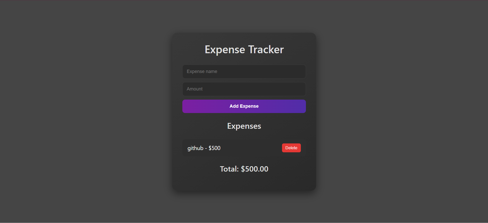

## 💸 Expense Tracker

A minimal and aesthetic expense tracker built using **HTML**, **CSS**, and **JavaScript**. It allows users to add, view, and delete daily expenses with real-time updates and local storage support — all in a sleek dark theme.

### ✨ Features

* Add new expenses with name and amount
* View your total expense dynamically
* Delete individual expenses
* Data is saved using **localStorage**
* Clean dark UI with soft hover animations

### 📸 Screenshots

```

```

### 🛠️ Tech Stack

* HTML5
* CSS3 (Custom styling, transitions)
* JavaScript (DOM, Events, LocalStorage)

### 🚀 How to Use

1. Open the app in your browser.
2. Enter an expense name and amount.
3. Click **Add Expense**.
4. Your expenses and total will appear below.
5. Click **Delete** to remove an entry.

---

